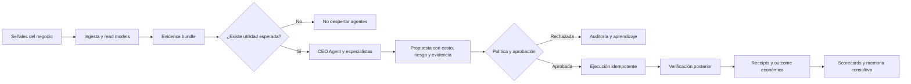
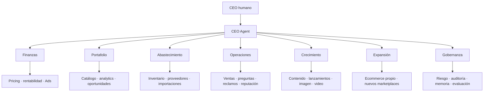
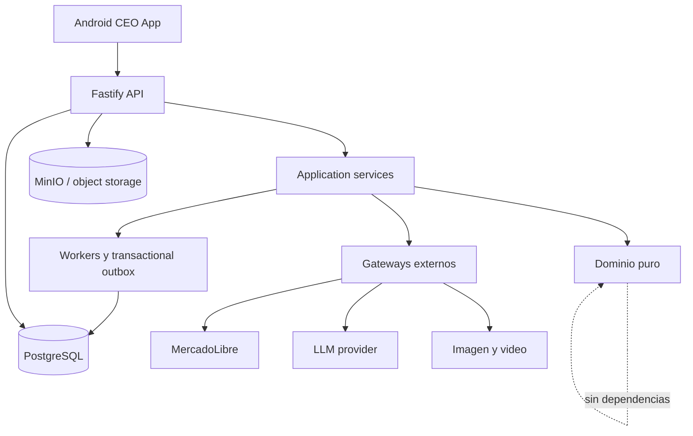

<div align="center">

# EAUTO-AI

### La empresa agéntica de comercio dirigida desde Android

**Convierte datos operativos en decisiones con evidencia, aprobación por riesgo, ejecución verificable y aprendizaje basado en resultados reales.**

[](https://github.com/riquelmechile/EAUTO-AI/actions/workflows/ci.yml)


`Observa` · `Prioriza` · `Propone` · `Aprueba` · `Ejecuta` · `Verifica` · `Aprende`

</div>

> [!NOTE]
> El primer contexto operacional es **MercadoLibre Chile**, con **Plasticov** y **Maustian** como cuentas independientes. La arquitectura está diseñada para crecer hacia ecommerce propio, proveedores, publicidad, redes sociales y otros marketplaces.

> [!IMPORTANT]
> **Estado actual:** la fundación técnica está construida, auditada y ejecutable. El despliegue comercial real todavía requiere infraestructura, secretos y validación live de proveedores. Las escrituras externas permanecen **fail-closed** hasta contar con evidencia, política, aprobación y verificación posterior.

## Por qué existe

Operar comercio digital suele significar revisar datos fragmentados, reaccionar tarde, repetir tareas manuales y confiar en automatizaciones que no pueden demostrar qué hicieron realmente.

EAUTO-AI busca resolver ese problema convirtiendo el negocio en una organización agéntica gobernada por un CEO humano.

| Problema operativo | Respuesta de EAUTO-AI |
| --- | --- |
| Información repartida entre ventas, publicaciones, reclamos, anuncios y proveedores | Un modelo operacional autoritativo con aislamiento por organización y cuenta |
| Decisiones reactivas o basadas en intuición | Evidencia fresca, utilidad esperada, costo y riesgo antes de activar razonamiento |
| Automatizaciones que actúan sin control | Políticas explícitas, RBAC, aprobación humana y máquinas de estado fail-closed |
| Una API responde `200`, pero nadie sabe si la acción ocurrió | Lectura posterior, receipts append-only y outcomes verificados |
| Agentes que inventan, se autoconceden permisos o delegan sin límite | Contratos de rol, skills versionadas, preflight, presupuestos y máximo de delegación |
| Dos cuentas comerciales que pueden contaminarse entre sí | Scope obligatorio por organización, cuenta e idempotency key |
| Costos de IA difíciles de justificar | Wake policy por utilidad esperada y costeo de cache hit, cache miss y output |

## La visión

**Un CEO humano dirige desde Android una empresa digital que observa 24/7, despierta agentes solo cuando vale la pena, prepara acciones verificables y aprende únicamente de resultados comprobados.**

El KPI central no es “cantidad de agentes” ni “tokens procesados”:

> **Beneficio neto sostenible y verificable, ajustado por riesgo, capital y costo de IA.**

## Cómo funciona



La autonomía no nace de una respuesta del modelo. Cada paso pasa por controles deterministas fuera del LLM.

## Qué hace diferente a EAUTO-AI

### 1. Agent OS, no prompts sueltos

Cada agente tiene un contrato de rol, capabilities permitidas, skills versionadas, evidencia obligatoria, presupuesto, timeout, máximo de iteraciones, autonomía predeterminada y scorecard.

La [skill Agent OS](doctrine/skills/agent-os/SKILL.md) resume el principio central: **los modelos ayudan a razonar, pero nunca sustituyen políticas, evidencia ni máquinas de estado**.

### 2. Skills como contratos verificables

Una skill no es una competencia que el agente declara tener. Es un contrato versionado que define:

- qué puede y qué no puede hacer;
- qué evidencia necesita;
- qué riesgo y presupuesto admite;
- cuándo requiere aprobación humana;
- cuántas iteraciones puede ejecutar;
- qué salidas y receipts debe producir.

Los contratos y las skills se hashean durante el preflight. Un cambio de versión invalida el contexto estable anterior.

### 3. Confianza verificable

EAUTO-AI separa explícitamente:

```text
propuesta ≠ aprobación ≠ ejecución ≠ verificación ≠ outcome
```

Una acción sensible solo puede avanzar con evidencia, policy hash, scope, aprobación y receipt chain. Cuando el resultado externo no puede confirmarse, la acción queda en estado `uncertain` y no se reintenta ciegamente.

### 4. Autonomía limitada por diseño

El sistema opera con tres niveles conceptuales:

| Modo | Comportamiento |
| --- | --- |
| `ask` | Prepara y solicita aprobación |
| `inform` | Ejecuta solo dentro de una política previamente autorizada e informa |
| `autonomous` | Reservado para capacidades con historial, presupuesto, rollback y política explícita |

La fundación actual mantiene las mutaciones externas en modo controlado. Ningún agente puede promover su propia autonomía.

## Organización agéntica



La jerarquía admite como máximo dos niveles reales de delegación: **CEO Agent → director → especialista**.

## Arquitectura



La regla de dependencias siempre apunta hacia el dominio. El dominio no conoce Fastify, PostgreSQL, Android ni proveedores de IA.

## Estado actual

**Leyenda:** ✅ verificado · 🟡 integración pendiente · 🔒 bloqueado intencionalmente

| Área | Estado | Qué existe hoy |
| --- | :---: | --- |
| Dominio y gobernanza | ✅ | Dinero, evidencia, objetivos, políticas, autonomía y máquinas de estado |
| Aislamiento multi-cuenta | ✅ | Scope por organización y cuenta para Plasticov y Maustian |
| Agent OS | ✅ | Catálogo, planner determinista, preflight, work sessions, heartbeats y scorecards |
| API | ✅ | Fastify, autenticación/RBAC, dashboard, inbox, acciones, receipts y operaciones |
| Android | ✅ | Control plane Expo/React Native, empresa, inbox, agentes y Content Studio |
| Persistencia | ✅ | PostgreSQL, migraciones idempotentes, constraints, leases y transacciones |
| Procesamiento 24/7 | ✅ | Worker recuperable, outbox, retries, dead-letter y replay administrativo |
| Evidencia y auditoría | ✅ | Evidence bundles, receipts SHA-256, delivery log y outcomes separados |
| Object storage | ✅ | MinIO, bucket privado, versionado, URLs firmadas y smoke test |
| Seguridad de despliegue | ✅ | Imágenes por digest, secrets fail-closed y GitHub Actions pinneadas por SHA |
| CI y release | ✅ | Formato, tipos, lint, tests, build, PostgreSQL real, Docker, MinIO y doctors |
| MercadoLibre live | 🟡 | Contratos, OAuth/webhook y guards preparados; faltan credenciales y validación real |
| Proveedores de contenido | 🟡 | Gateway y simulación trazable; faltan adaptadores reales de imagen/video |
| Escrituras externas autónomas | 🔒 | Deshabilitadas hasta validar política, rollback y verificación post-acción |
| Operación comercial en producción | 🟡 | Falta infraestructura, secretos, restore drill, AAB real y pruebas live |

### Qué puede demostrarse hoy

- La suite completa, el build server/mobile y los doctors pasan en CI.
- Las migraciones corren contra PostgreSQL limpio y verifican idempotencia y concurrencia.
- Las cuentas están aisladas por organización, cuenta, constraints e idempotency keys.
- Las acciones sensibles recorren propuesta → review → aprobación → ejecución → verificación.
- Los receipts forman una cadena append-only verificable.
- El runtime productivo usa imágenes inmutables y falla si no puede descargar el artefacto correcto.
- La release Android espera el AAB firmado y, opcionalmente, envía ese build ID exacto a Google Play.

### Qué falta antes de operar dinero real

- configurar dominios, servidor y secretos productivos;
- conectar DeepSeek y los adapters externos seleccionados;
- validar OAuth, webhooks e ingesta con Plasticov y Maustian;
- ejecutar backup y restore drill fuera del repositorio;
- generar e instalar el primer AAB firmado en un dispositivo real;
- validar acciones MercadoLibre en shadow mode antes de habilitar cualquier escritura;
- medir outcomes económicos reales antes de promover autonomía.

Consulte el [roadmap actualizado](docs/ROADMAP.md) para ver las siguientes fases.

## Stack

| Capa | Tecnología |
| --- | --- |
| Lenguaje | TypeScript 5.8 en modo estricto |
| Runtime | Node.js 22+ |
| API | Fastify |
| Android | Expo + React Native |
| Datos | PostgreSQL 17 |
| Objetos | MinIO / S3-compatible storage |
| Procesamiento | Workers, leases y transactional outbox |
| Pruebas | Vitest + smokes productivos |
| Infraestructura | Docker Compose + Caddy |
| CI/CD | GitHub Actions pinneadas por SHA, GHCR y EAS |

## Inicio rápido

### Requisitos

- Node.js 22.13 o superior;
- npm 10 o superior;
- Docker y Docker Compose;
- Android Studio o Expo/EAS para Android.

### Aplicación local

```bash
npm ci
npm run check
npm run dev:api
```

En terminales separadas:

```bash
npm run dev:worker
npm run dev:mobile
```

Android Emulator usa por defecto `http://10.0.2.2:3000`. Para un teléfono físico:

```bash
EXPO_PUBLIC_API_URL=http://IP_DE_TU_PC:3000 npm run dev:mobile
```

### Infraestructura completa con Docker

```bash
docker compose -f infra/compose/docker-compose.yml up -d
npm run doctor
```

En desarrollo, `AUTH_MODE=disabled` crea un owner local. En producción se exige `AUTH_MODE=static-token`, PostgreSQL, una identidad hashada y configuración completa validada por `doctor:production`.

## Flujo de calidad

```bash
npm run format:check
npm run typecheck
npm run lint
npm test
npm run build
npm run doctor
```

La CI añade validaciones contra PostgreSQL real, migraciones, Compose, Caddy, Docker, MinIO, configuración productiva, release Android y cadena de suministro.

<details>
<summary><strong>Endpoints principales</strong></summary>

### Plataforma

- `GET /health`
- `GET /ready`
- `GET /v1/me`
- `GET /v1/dashboard`
- `GET /v1/inbox`

### Acciones y auditoría

- `POST /v1/actions`
- `POST /v1/actions/:id/review`
- `POST /v1/actions/:id/approve`
- `POST /v1/actions/:id/execute`
- `GET /v1/actions/:id/receipts`

### Agent OS

- `GET /v1/agent-os/catalog`
- `POST /v1/agent-os/:accountId/plans/company`
- `POST /v1/agent-os/:accountId/preflight`
- `POST /v1/agent-os/:accountId/sessions`
- `GET /v1/agent-os/:accountId/scorecards`

### Operaciones

- `GET /v1/operations/outbox`
- `GET /v1/operations/outbox/dead`
- `POST /v1/operations/outbox/dead/:id/requeue`

</details>

## Principios no negociables

1. No inventar datos faltantes.
2. El dominio no depende del LLM ni de frameworks.
3. Memoria no equivale a verdad operacional.
4. Aprobación no equivale a outcome.
5. Una respuesta HTTP exitosa no equivale a ejecución verificada.
6. Plasticov y Maustian permanecen aislados por cuenta.
7. Android es el plano de control; los procesos 24/7 viven en backend persistente.
8. Toda acción sensible requiere evidencia, política, aprobación y receipts.
9. El razonamiento se activa por utilidad esperada, no por round-robin ciego.
10. Las rutas productivas no usan fixtures silenciosos.

## Doctrina de ingeniería

La arquitectura sigue los principios de [The Amazing Gentleman Programming Book](https://the-amazing-gentleman-programming-book.vercel.app/es), traducidos a contratos, skills, policies, gates, pruebas y evidencia verificable. El libro no se reenvía completo al LLM ni se utiliza como sustituto del diseño del sistema.

## Documentación

| Documento | Contenido |
| --- | --- |
| [Visión de producto](docs/PRODUCT_VISION.md) | Problema, resultado buscado y KPI |
| [Agent OS](docs/AGENT_OS.md) | Organización, roles, skills, preflight, sesiones y scorecards |
| [Arquitectura objetivo](docs/TARGET_ARCHITECTURE.md) | Capas y planos del sistema |
| [Política de autonomía](docs/AUTONOMY_POLICY.md) | Riesgo, aprobación y promoción controlada |
| [Confianza verificable](docs/VERIFIABLE_TRUST.md) | Evidencia, receipts y outcomes |
| [Seguridad e identidad](docs/SECURITY_AND_IDENTITY.md) | RBAC, scopes y secretos |
| [LLM Gateway](docs/LLM_GATEWAY.md) | Provider, caché, costos y límites |
| [Roadmap](docs/ROADMAP.md) | Estado real y próximas fases |
| [Release de producción](docs/runbooks/production-release.md) | Despliegue, Android, backups y rollback |

---

<div align="center">

**EAUTO-AI no busca reemplazar al dueño del negocio. Busca darle una empresa digital que observe, razone y actúe con disciplina verificable.**

</div>
