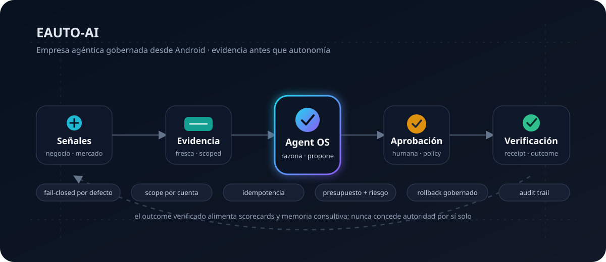
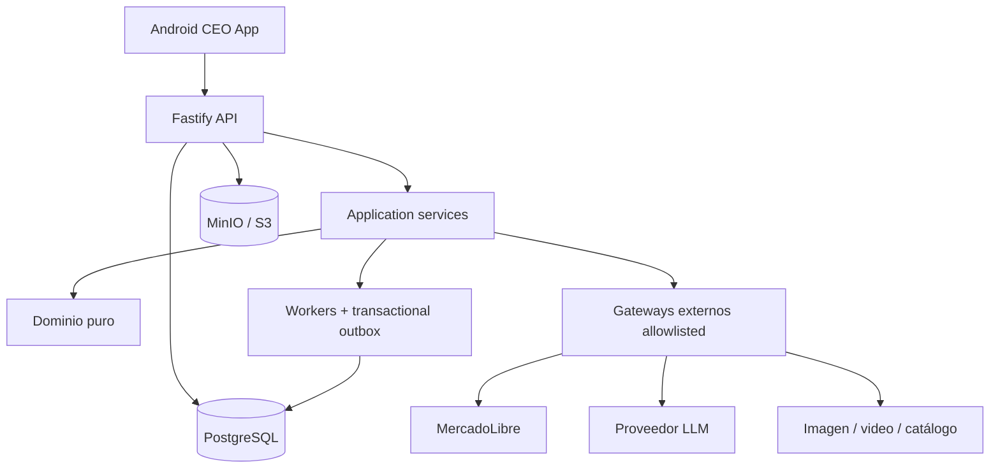
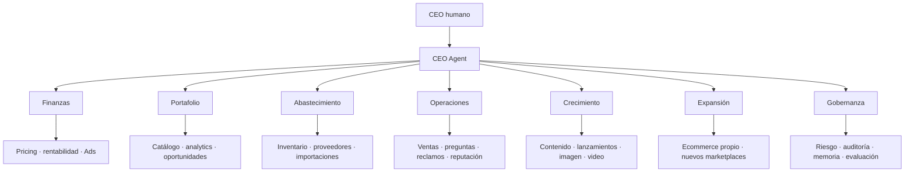

<div align="center">

# EAUTO-AI

### La empresa agéntica de comercio dirigida desde Android

**Convierte señales operativas en decisiones con evidencia, aprobación por riesgo, ejecución verificable y aprendizaje basado en outcomes reales.**

[](https://github.com/riquelmechile/EAUTO-AI/actions/workflows/ci.yml)


</div>

<p align="center">
  
</p>

> [!IMPORTANT]
> **Estado real:** la base técnica es ejecutable y está protegida por CI, tests, doctors, aislamiento multi-cuenta y gates fail-closed. **Release técnico reproducible ≠ producción comercial live.** Los gates externos de MercadoLibre, infraestructura, AAB físico y restore drill siguen rastreados en [#41](https://github.com/riquelmechile/EAUTO-AI/issues/41).

## En 60 segundos

EAUTO-AI es un **control plane agéntico para comercio digital**. Un CEO humano dirige desde Android; el backend observa el negocio 24/7, organiza evidencia, despierta agentes solo cuando existe una razón económica y convierte sus propuestas en acciones gobernadas.

No confía en que un modelo “diga que hizo algo”. El sistema separa explícitamente:

```text
señal → evidencia → razonamiento → propuesta → aprobación → ejecución → verificación → outcome
```

La primera operación objetivo es **MercadoLibre Chile**, manteniendo **Plasticov** y **Maustian** como cuentas aisladas. La arquitectura está preparada para proveedores, publicidad, ecommerce propio, contenido y otros marketplaces.

### Qué resuelve

| Problema                                                             | Respuesta de EAUTO-AI                                             |
| -------------------------------------------------------------------- | ----------------------------------------------------------------- |
| Datos repartidos entre ventas, catálogo, Ads, reclamos y proveedores | Read models y evidencia scoped por organización y cuenta          |
| Decisiones reactivas                                                 | Utilidad esperada, costo, riesgo y freshness antes de razonar     |
| Automatizaciones que actúan sin control                              | Policy, RBAC, aprobación humana y máquinas de estado fail-closed  |
| Una API responde `200` y nadie sabe qué ocurrió                      | Verificación posterior, receipts append-only y outcomes separados |
| Agentes que inventan autoridad                                       | Skills versionadas, preflight, budgets y capabilities explícitas  |
| Contaminación entre cuentas                                          | Scope compuesto, constraints e idempotency keys por cuenta        |
| IA cara sin impacto comprobable                                      | Wake policy económica, costo de inferencia y scorecards           |

## Inicio rápido

### Requisitos

- Node.js 22.13 o superior;
- npm 10 o superior;
- Docker y Docker Compose;
- Android Studio o Expo/EAS si se ejecutará la app móvil.

### Camino mínimo

```bash
npm ci
npm run check
npm run dev:api
```

En terminales separadas:

```bash
npm run dev:worker
npm run dev:mobile
```

Android Emulator usa `http://10.0.2.2:3000` por defecto. En un dispositivo físico:

```bash
EXPO_PUBLIC_API_URL=http://IP_DE_TU_PC:3000 npm run dev:mobile
```

### Infraestructura local completa

```bash
docker compose -f infra/compose/docker-compose.yml up -d
npm run doctor
```

En desarrollo, `AUTH_MODE=disabled` puede crear un owner local. Producción exige autenticación, PostgreSQL y configuración validada por `doctor:production`.

## Modelo mental

### El LLM propone; el sistema conserva la autoridad

El modelo puede investigar, resumir, comparar y proponer. No controla por sí mismo:

- scope de organización o cuenta;
- permisos;
- thresholds económicos;
- policy version;
- aprobación;
- idempotencia;
- evidencia requerida;
- estado final de una acción;
- verificación post-ejecución.

Cuando el resultado externo no puede reconciliarse, la acción termina en `uncertain`. El sistema no interpreta incertidumbre como éxito ni reintenta a ciegas.

### Agent OS, no prompts sueltos

Cada perfil de agente está definido por contratos versionados: capabilities, evidencia obligatoria, presupuesto, timeout, máximo de iteraciones, modo de autonomía y scorecard. La [skill Agent OS](doctrine/skills/agent-os/SKILL.md) conserva la regla central: **razonamiento probabilístico dentro de límites deterministas**.

### Autonomía por evidencia

| Modo         | Comportamiento                                                                      |
| ------------ | ----------------------------------------------------------------------------------- |
| `ask`        | Prepara la acción y solicita aprobación                                             |
| `inform`     | Solo puede ejecutar dentro de una policy previamente autorizada e informa           |
| `autonomous` | Reservado para capabilities con historial real, budget, rollback y policy explícita |

Ningún agente puede promover su propio nivel de autonomía. El gate live para aumentarla está definido en [#41](https://github.com/riquelmechile/EAUTO-AI/issues/41).

## Estado verificable

**Leyenda:** ✅ implementado/gateado en código · 🟡 requiere integración o evidencia live · 🔒 bloqueado intencionalmente

| Área                      | Estado | Evidencia disponible en el proyecto                                              |
| ------------------------- | :----: | -------------------------------------------------------------------------------- |
| Dominio y gobernanza      |   ✅   | Dinero, evidencia, policy, autonomía y máquinas de estado                        |
| Aislamiento multi-cuenta  |   ✅   | Scope por organización/cuenta, constraints e idempotencia                        |
| Agent OS                  |   ✅   | Catálogo, preflight, work sessions, heartbeats, perfiles daemon y scorecards     |
| API                       |   ✅   | Fastify, auth/RBAC, dashboard, inbox, acciones, receipts y operaciones           |
| Android                   |   ✅   | Control plane Expo/React Native, cuentas, agentes, operaciones y Content Studio  |
| Persistencia              |   ✅   | PostgreSQL, migraciones idempotentes, leases y transacciones                     |
| Procesamiento 24/7        |   ✅   | Workers recuperables, outbox, retries, dead-letter y replay                      |
| Evidencia y auditoría     |   ✅   | Evidence bundles, receipts SHA-256 y outcomes separados                          |
| Object storage            |   ✅   | MinIO/S3 privado, versionado, signed URLs y smoke contractual                    |
| Seguridad de supply chain |   ✅   | Actions pinneadas a SHA, audit, imagen por digest, SBOM y provenance             |
| CI/release técnico        |   ✅   | Formato, tipos, lint, tests, cobertura, build, PostgreSQL, Docker y doctors      |
| MercadoLibre live         |   🟡   | Contratos/OAuth/webhook/Product Ads preparados; falta evidencia operacional real |
| Proveedores externos      |   🟡   | Gateways y contratos; las credenciales y validaciones live son externas al repo  |
| Producción comercial      |   🟡   | Depende de DNS/TLS, secretos, restore, AAB físico y ventanas de reconciliación   |
| Autonomía externa         |   🔒   | No se promueve hasta cumplir los gates temporales y operativos de #41            |

Para la definición exacta de “release listo”, consulte [Readiness de release y producción](docs/RELEASE_READINESS.md).

## Arquitectura



La dirección de dependencias apunta hacia el dominio. `packages/domain` no necesita conocer Fastify, PostgreSQL, Android ni proveedores externos.

## Organización agéntica



La delegación real se limita a **CEO Agent → director → especialista**. Profundidad limitada significa menos autoridad implícita y una trazabilidad más simple.

## Calidad, seguridad y release

El comando corto de calidad es:

```bash
npm run check
```

La CI agrega gates que no caben en una prueba unitaria: lockfile reproducible, audit de dependencias, cobertura, PostgreSQL real, migraciones, colisiones de idempotencia, credentials doctor, capability doctors, Compose, Caddy, Docker y object storage.

El workflow de release vuelve a ejecutar calidad antes de construir artefactos y usa:

- GitHub Actions fijadas a commits SHA;
- checkout sin credenciales persistentes;
- contenedor multi-arquitectura;
- SBOM y provenance;
- digest inmutable de GHCR;
- build EAS esperado hasta finalización;
- build ID Android exacto para un eventual submit a Play.

> [!NOTE]
> Publicar `v0.1.0` valida el commit y sus artefactos. No cierra automáticamente el checklist live de [#41](https://github.com/riquelmechile/EAUTO-AI/issues/41).

## Producción

Los secretos reales no pertenecen al repositorio. El flujo previsto es:

```bash
npm run credentials:generate -- --output=.env.production
npm run credentials:doctor -- --env=.env.production
npm run doctor:production -- --env=.env.production
```

Antes de mover dinero real se requieren, entre otros, DNS/TLS productivo, credenciales de proveedores, Plasticov live, refresh/webhook observados, Product Ads reconciliado, restore drill, AAB físico y outcomes económicos reales. El checklist completo vive en [docs/RELEASE_READINESS.md](docs/RELEASE_READINESS.md) y en el issue [#41](https://github.com/riquelmechile/EAUTO-AI/issues/41).

## Stack

| Capa            | Tecnología                             |
| --------------- | -------------------------------------- |
| Lenguaje        | TypeScript 5.8 estricto                |
| Runtime         | Node.js 22+                            |
| API             | Fastify                                |
| Android         | Expo + React Native                    |
| Datos           | PostgreSQL 17                          |
| Objetos         | MinIO / S3-compatible storage          |
| Procesamiento   | Workers, leases y transactional outbox |
| Tests           | Vitest + smokes productivos            |
| Infraestructura | Docker Compose + Caddy                 |
| CI/CD           | GitHub Actions, GHCR y EAS             |

<details>
<summary><strong>Endpoints principales</strong></summary>

### Plataforma

- `GET /health`
- `GET /ready`
- `GET /v1/me`
- `GET /v1/dashboard`
- `GET /v1/inbox`

### Acciones y auditoría

- `POST /v1/actions`
- `POST /v1/actions/:id/review`
- `POST /v1/actions/:id/approve`
- `POST /v1/actions/:id/execute`
- `GET /v1/actions/:id/receipts`

### Agent OS

- `GET /v1/agent-os/catalog`
- `POST /v1/agent-os/:accountId/plans/company`
- `POST /v1/agent-os/:accountId/preflight`
- `POST /v1/agent-os/:accountId/sessions`
- `GET /v1/agent-os/:accountId/scorecards`

### Operaciones

- `GET /v1/operations/outbox`
- `GET /v1/operations/outbox/dead`
- `POST /v1/operations/outbox/dead/:id/requeue`

</details>

<details>
<summary><strong>Principios no negociables</strong></summary>

1. No inventar datos faltantes.
2. El dominio no depende del LLM ni de frameworks.
3. Memoria no equivale a verdad operacional.
4. Aprobación no equivale a outcome.
5. Una respuesta HTTP exitosa no equivale a ejecución verificada.
6. Plasticov y Maustian permanecen aislados por cuenta.
7. Android es el plano de control; los procesos 24/7 viven en backend persistente.
8. Toda acción sensible requiere evidencia, policy, aprobación y receipts.
9. El razonamiento se activa por utilidad esperada, no por round-robin ciego.
10. Las rutas productivas no usan fixtures silenciosos.

</details>

## Solución de problemas

### `npm run doctor` falla

Ejecute primero:

```bash
npm ci
npm run check
```

Después revise la salida del doctor específico. No reemplace un gate fallido por un valor inventado ni desactive la validación para conseguir un verde artificial.

### Android no llega a la API desde un teléfono

`localhost` apunta al teléfono. Use la IP de la máquina que ejecuta EAUTO-AI:

```bash
EXPO_PUBLIC_API_URL=http://IP_DE_TU_PC:3000 npm run dev:mobile
```

En producción, la URL pública debe ser HTTPS.

### Falta una credencial productiva

Use el inventario y doctor de credenciales. Nunca copie un secreto a Markdown, issues, logs o commits:

```bash
npm run credentials:doctor -- --env=.env.production
```

### Un proveedor externo devuelve un resultado dudoso

El adapter debe fallar cerrado. No convierta una observación de proveedor en autoridad de scope, identidad, policy o aprobación.

### Una acción externa no puede verificarse

Debe permanecer `uncertain` hasta reconciliar evidencia. No la marque como exitosa ni la reintente a ciegas.

## Documentación

| Documento                                                      | Contenido                                                     |
| -------------------------------------------------------------- | ------------------------------------------------------------- |
| [Readiness de release y producción](docs/RELEASE_READINESS.md) | Qué certifica una release y qué exige producción live         |
| [Visión de producto](docs/PRODUCT_VISION.md)                   | Problema, resultado buscado y KPI                             |
| [Agent OS](docs/AGENT_OS.md)                                   | Organización, roles, skills, preflight, sesiones y scorecards |
| [Arquitectura objetivo](docs/TARGET_ARCHITECTURE.md)           | Capas y planos del sistema                                    |
| [Política de autonomía](docs/AUTONOMY_POLICY.md)               | Riesgo, aprobación y promoción controlada                     |
| [Confianza verificable](docs/VERIFIABLE_TRUST.md)              | Evidencia, receipts y outcomes                                |
| [Seguridad e identidad](docs/SECURITY_AND_IDENTITY.md)         | RBAC, scopes y secretos                                       |
| [LLM Gateway](docs/LLM_GATEWAY.md)                             | Provider, caché, costos y límites                             |
| [Proveedores de producción](docs/PRODUCTION_PROVIDERS.md)      | Contratos y configuración externa                             |
| [Roadmap](docs/ROADMAP.md)                                     | Estado y próximas fases                                       |
| [Runbook de producción](docs/runbooks/production-release.md)   | Despliegue, Android, backups y rollback                       |

## Doctrina de ingeniería

La arquitectura aplica principios de [The Amazing Gentleman Programming Book](https://the-amazing-gentleman-programming-book.vercel.app/es) mediante contratos, skills, policies, gates, tests y evidencia verificable. El libro no sustituye el diseño del sistema ni se usa como autoridad operacional.

---

<div align="center">

**EAUTO-AI no reemplaza al dueño del negocio: le entrega un sistema que observa, propone y ejecuta dentro de límites verificables.**

</div>
